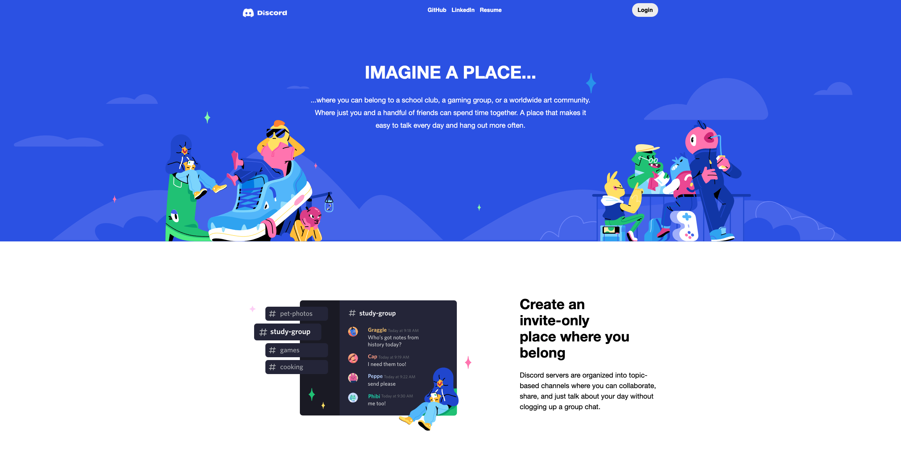
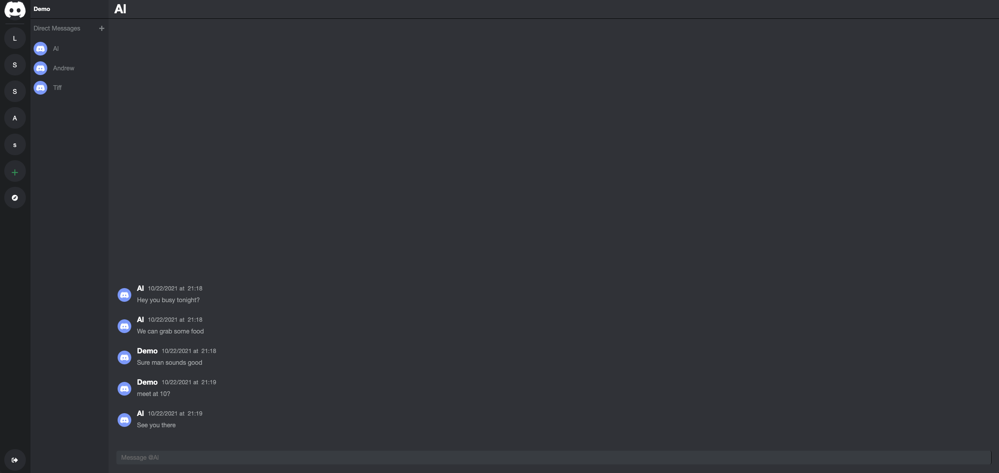
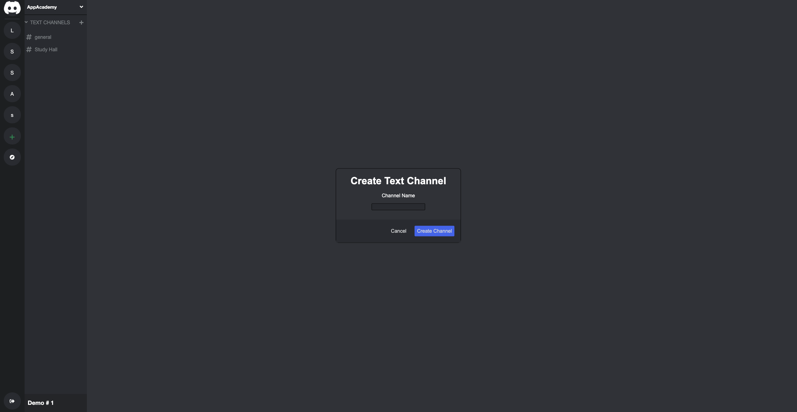

# [Dissonance](https://dissonance-fs.herokuapp.com)

Dissonance is a texting platform where users can communicate with others and create their own communities. Users are able to create an account, create servers and channels, as well as join existing servers that they are not a part of. They can also edit exisiting servers and channels that they have created.






# Features
* Users are able to create, delete and edit servers
* Users that are part of a server can create new text channels 
* Users can explore and join other servers that they are not a part of 
* Users are able to send messages in chat channels or make direct messages to other users

# Challenges
* One challenge I encountered was retrieving and formatting messages belonging to a channel. Initially, every single message within the database was showing in every channel. In order to resolve this issue I needed to match the dmChannelId field of the channel to the action. As for the formatting I had to split up the timestamps and reverse the order they appeared.

```js 
componentDidMount() {
    this.props.fetchDmChannels(this.props.currentUser.id)
}
    
componentDidUpdate(prevProps) {
    if (this.props.match.params.dmChannelId !== undefined && prevProps.match.params.dmChannelId !== this.props.match.params.dmChannelId) {
        this.props.fetchChannelDms(this.props.dmChannelId)
    }
    if (this.props.directMessages.length !== prevProps.directMessages.length) {
        this.props.fetchChannelDms(this.props.dmChannelId)
    }
}
```

```js
{this.props.directMessages.reverse().map(message => {
    return <li key={message.id} className="message-item">
    
    <div className="message-title">
        <div className="date">
            <h3>{message.user.username}</h3>
            <p id="date-format">
                {message.created_at.slice(5,7)}/
                {message.created_at.slice(8,10)}/
                {message.created_at.slice(0,4)} at &nbsp;
                {message.created_at.slice(11, 16)}
            </p>
        </div>
        <div className="body">
            <p>{message.body}</p>
        </div>
    </div>
</li>
})}
```


* Another challenge I faced was implementing live chat. In order to achieve this, I needed to utilize websockets. It was very confusing at first but after reading documentation and watching videos, I was able understand it. Basically when a user enters a channel, the user subscribes to the channel which in turn listens for any updates on the channel and renders any changes. 

```js
componentDidMount() {
    this.props.fetchDmChannels(this.props.currentUser.id)
    this.subscribe()
}

componentWillUnmount() {
    if (this.subscription) {
        this.subscription.unsubscribe()
    }
}

subscribe() {
    this.subscription = consumer.subscriptions.create(
    {channel: "UserChannel", id: this.state.value},
        {
        received: data => {
            this.props.fetchDmChannels()
            this.setState({
                display: false, 
                dm: false,
                value: ""
            })
        }
        }
    )
}
```

# Technologies Used
* Ruby 2.7.3
* Rails 6.1.4.1
* Node v14.15.1
* PostgreSQL 10.17 
* Action Cable
* WebSockets
* HTML
* SCSS

# Future Plans
* Add messages to channels with real time rendering 
* Add direct messages between users
* Add members sidebar to channels


